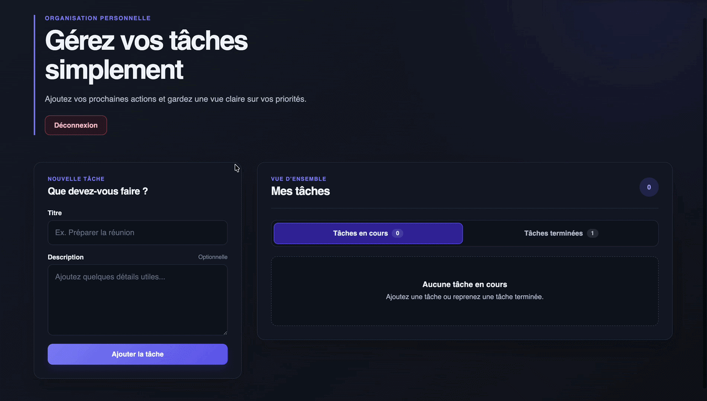

# Todo List

Application Todo full-stack permettant à chaque utilisateur de créer et gérer
ses tâches dans un espace personnel.

Le projet est un monorepo TypeScript composé d'un frontend React et d'une API
Express connectée à une base de données MySQL.

## Démonstration

### Authentification


### Gestion des tâches



## Fonctionnalités

- création d'un compte et connexion ;
- authentification par cookie JWT `httpOnly` ;
- persistance de la connexion après rechargement grâce à `GET /api/me` ;
- déconnexion ;
- création, modification et suppression de tâches ;
- validation et suppression de tâches ;
- séparation entre les tâches en cours et les tâches terminées ;

## Technologies

### Frontend

- React 19 ;
- TypeScript ;
- React Router ;
- Vite ;
- CSS.

### Backend

- Node.js ;
- Express ;
- TypeScript ;
- MySQL ;
- Argon2 ;
- JSON Web Token ;

### Qualité du code

- Biome ;
- TypeScript ;
- Commitlint.

## Structure du projet

```text
todolist/
├── client/
│   └── src/
│       ├── components/
│       ├── context/
│       ├── hooks/
│       ├── pages/
│       └── types/
├── server/
│   ├── database/
│   ├── src/
│   │   ├── modules/
│   │   └── types/
│   └── tests/
├── docker-compose.yml
└── package.json
```

## Prérequis

- Node.js ;
- npm ;
- MySQL 8, ou Docker avec Docker Compose.

## Installation locale

Cloner le dépôt puis installer les dépendances :

```bash
git clone <url-du-depot>
cd todolist
npm install
```

Créer les fichiers d'environnement à partir des modèles :

```bash
cp client/.env.sample client/.env
cp server/.env.sample server/.env
```

Configurer ensuite les variables selon l'environnement local.

### Variables du client

```dotenv
VITE_API_URL=http://localhost:3310
```

### Variables du serveur

```dotenv
APP_PORT=3310
DB_HOST=localhost
DB_PORT=3306
DB_USER=your_user
DB_PASSWORD=your_password
DB_NAME=todolist
JWT_SECRET=replace_with_a_long_random_secret
CLIENT_URL=http://localhost:3000
```

Ne jamais versionner les véritables secrets ni le contenu des fichiers `.env`.

## Base de données

Créer ou mettre à jour la base à partir de
`server/database/schema.sql` :

```bash
npm run db:migrate
```

> Attention : la commande de migration supprime puis recrée la base configurée
> dans `DB_NAME`. Les données existantes seront perdues.

## Lancement

Démarrer simultanément le client et le serveur :

```bash
npm run dev
```

L'application est alors disponible sur :

- frontend : [http://localhost:3000](http://localhost:3000) ;
- API : [http://localhost:3310](http://localhost:3310).

Il est également possible de démarrer chaque partie séparément :

```bash
npm run dev:client
npm run dev:server
```

## Routes de l'API

### Authentification

| Méthode | Route | Description |
| --- | --- | --- |
| `POST` | `/api/register` | Créer un compte |
| `POST` | `/api/login` | Se connecter et créer le cookie JWT |
| `POST` | `/api/logout` | Supprimer le cookie JWT |
| `GET` | `/api/me` | Récupérer l'utilisateur connecté |

### Tâches avec CRUD

Toutes les routes suivantes sont protégées par l'authentification :

| Méthode | Route | Description |
| --- | --- | --- |
| `GET` | `/api/todos` | Récupérer les tâches |
| `POST` | `/api/todos` | Ajouter une tâche |
| `PUT` | `/api/todos/:id` | Modifier une tâche |
| `PATCH` | `/api/todos/:id` | Modifier son état terminé |
| `DELETE` | `/api/todos/:id` | Supprimer une tâche |

Exemple de tâche :

```json
{
  "id": 1,
  "title": "Réviser React",
  "description": "Relire les hooks",
  "is_completed": false,
  "created_at": "2026-07-23T10:00:00.000Z",
  "updated_at": "2026-07-23T10:00:00.000Z"
}
```

## Authentification

Le serveur place le JWT dans un cookie `httpOnly`. Le frontend ne stocke donc
pas le token dans `localStorage` ou `sessionStorage`.

Lors de l'ouverture de la Todo List, la route protégée attend la réponse de
`GET /api/me` :

- un utilisateur valide donne accès à l'application ;
- une réponse non authentifiée redirige vers `/login` ;
- le chargement est affiché pendant la vérification.

Les requêtes utilisent `credentials: "include"` par l'intermédiaire du helper
`ApiFetch`.

## Scripts utiles

| Commande | Description |
| --- | --- |
| `npm run dev` | Démarrer le client et le serveur |
| `npm run build` | Construire les workspaces |
| `npm run check` | Vérifier le formatage et les types |
| `npm run test` | Exécuter les tests disponibles |
| `npm run db:migrate` | Recréer la base depuis le schéma SQL |
| `npm run db:seed` | Insérer les données de démonstration |

## Vérifications avant un commit

```bash
npm run check
npm run test
```

## Licence

Ce projet est distribué sous licence MIT. Consultez
[`LICENSE.md`](./LICENSE.md) pour plus d'informations.
